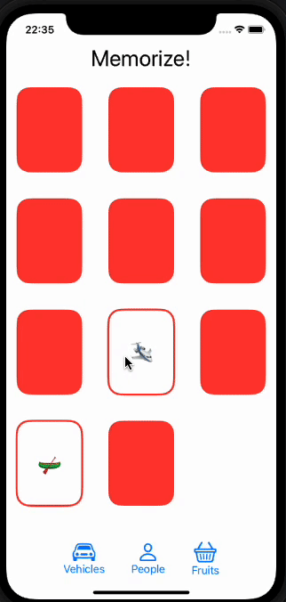

#  Memorize app

## This repository contains the result of Stanford material 01 exercise

- [Class video](https://www.youtube.com/watch?v=bqu6BquVi2M)
- [PDF With exercise](https://cs193p.sites.stanford.edu/sites/g/files/sbiybj16636/files/media/file/assignment_1.pdf)

#### This exercise is pretty good to learn the basics about SwiftUI, if you want extract the best about the concepts of SwiftUI I recommend you watch and understand the video first and then try out the exercise from scratch

## App overview

